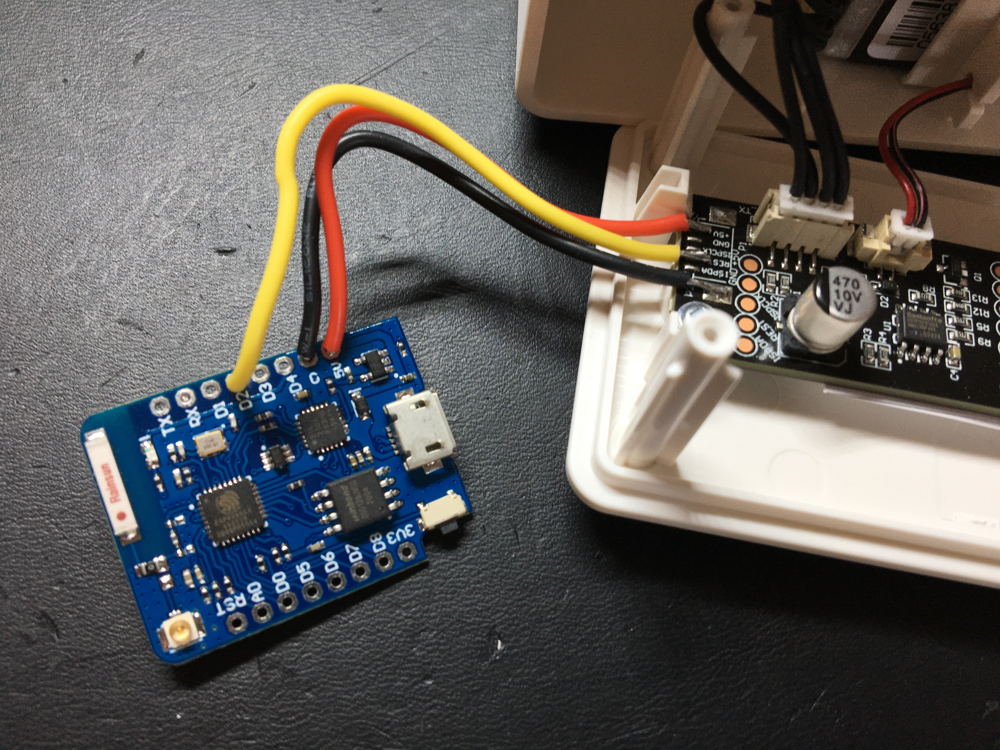

## VINDRIKTNING-esp8266-MQTT-Domoticz

Based on the idea from Sören Beye, see reference below, to add an esp8266 e.g. Wemos D1 mini pro, to the IKEA VINDRIKTNING PM2.5 air quality sensor, this code will publish the calculated average via MQTT to Domoticz. 

The first step is to create a virtual sensor in Domoticz to obtain a unique identifier (idx). Give the virtual sensor a name and use ug/m3 as the axis label. Save the device and take note of the idx value, since you will need this in the code later on.

## Hardware

Now it is time to open up the IKEA VINDRIKTNING by unscrewing the four screws in the back of the box. The front comes off and for ease of soldering, I recommend to disconnect the connectors and remove the three small screws. With the circuit board removed, solder wires to GND, 5V and the REST pin. The latter is actually the TX from the onboard microcontroller. Cut the wires to approximately 6cm and solder them to the GND, 5V and D2 respectively of a Wemos D2 Mini. 

The image above should give you an idea of the wiring. Alternatively, the round solder pads can also be used.

## Firmware

The firmware can be built and flashed using the Arduino IDE. To do this, you need to add ESP8266 support by [using the Boards Manager](https://github.com/esp8266/Arduino#installing-with-boards-manager). You will also need to install the following libraries using the Library Manager:

* PubSubClient
* WiFiManager

Now download the code from the repository to your system, unzip it and open the .ino file in the Arduino IDE. Once open, follow the comments in the code and enter the following information:

* ssid of your wireless network
* password of your wireless network
* ip address of your MQTT server (there is no need to add the 1883 listener port number as this is handled in the code)
* the unique identifier (idx) in the MQTT client connect section
* the unique identifier (idx) in the MQTT Payload section

After making these changes, do a Verify/Compile to check if everything is OK. If so, connect the Wemos via USB to your system and Upload the code. Open the Serial Monitor from the tools menu of the Arduino IDE. You should see the connectivity status, the data acquisition and every 60 seconds the MQTT Payload message.

Lastly, go to Domoticz and check if the virtual sensor starts to dispay a value in ug/m3. In a healthy environment this should be a value between 2 and 50.

## Background information

The VINDRIKTNING consists of Cubic PM1006-like Sensor + another uC that controls the leds and also outputs the serial TX data from the sensor. With the code we simply listen to the TX output of the uC, take 5 samples and calculate the average of these samples, create a MQTT message and publish the result to domoticz.

## ToDo

Using the ArduinoJSON library to dynamically create the payload message.

## References and sources

- Thanks to [Sören Beye](https://github.com/Hypfer/esp8266-vindriktning-particle-sensor) for the inspirational work and parts of the code.
